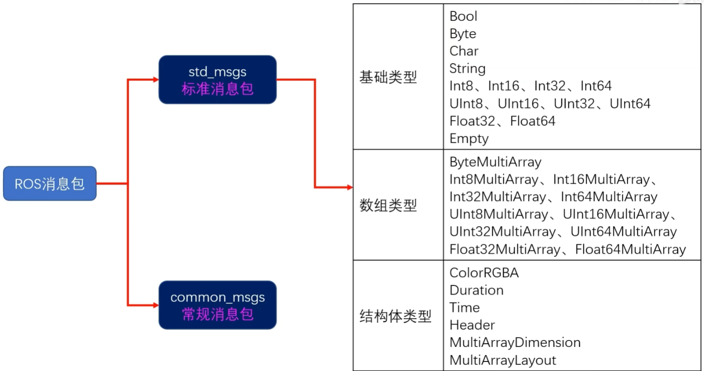

# 启动Cat_kin

```shell
# 新版本
mkdir catkin_ws
cd catkin_ws
git clone https://github.com/star-cheng/src.git
cd src
bash setup_noetic.sh
# 旧版本
mkdir catkin_ws
cd catkin_ws
mkdir src
cd src
git clone https://github.com/6-robot/wpr_simulation.git
cd wpr_simulation/scripts
./install_for_noetic.sh
cd ~/catkin_ws
catkin_make
vim ~/.bashrc
source ~/catkin_ws/devel/setup.bash
cd ~/catkin_ws/src
git clone https://github.com/6-robot/wpb_home.git
cd wpb_home/wpb_home_bringup/scripts
./install_for_noetic.sh
source ~/catkin_ws/devel/setup.bash
cd ~/catkin_ws
catkin_make
code
# Add Folder to Workspace
# Add src
```

## Project

### msckf_vio

```shell
# https://ltslam-doc.readthedocs.io/en/latest/msckf/msckf.html
cd ~/catkin_ws/src
git clone https://github.com/KumarRobotics/msckf_vio.git
cd ..
sudo apt-get install libsuitesparse-dev -y
sudo apt-get install ros-noetic-random-numbers -y
echo $CMAKE_PREFIX_PATH
source /opt/ros/noetic/setup.bash
source ~/catkin_ws/devel/setup.bash
catkin_make --pkg msckf_vio --cmake-args -DCMAKE_BUILD_TYPE=Release
# http://robotics.ethz.ch/~asl-datasets/ijrr_euroc_mav_dataset/vicon_room1/V1_01_easy/V1_01_easy.bag
# EuRoC
roslaunch msckf_vio msckf_vio_euroc.launch
# rosbag
rosbag play ~/code/catkin_ws/data/V1_01_easy.bag
# RVIZ load msckf_vio/rviz/rviz_euroc_config.rviz
rivz # or roslaunch msckf_vio demo.launch
```

+ cd :~/code/catkin_ws/src/wpr_simulation/scripts
+ ./install_for_noetic.sh
+ catkin_make
+ source /home/gym/code/catkin_ws/devel/setup.bash
+ roslaunch wpr_simulation wpb_simple.launch
<!-- + conda env: pip install rospkg -->
+ sudo apt install ros-noetic-teb-local-planner
+ cd /home/gym/code/catkin_ws/src/wpb_home/wpb_home_bringup/scripts
+ ./install_for_noetic.sh

### Fast_LIO

```shell
# 参考连接
# https://zhuanlan.zhihu.com/p/461246350
# https://zhuanlan.zhihu.com/p/471876061
git clone https://github.com/hku-mars/FAST_LIO.git
git clone https://github.com/Livox-SDK/livox_ros_driver.git
cd FAST_LIO/include
git clone https://github.com/hku-mars/ikd-Tree.git
# 启动运行fast_lio的demo
roslaunch fast_lio mapping_velodyne.launch
rosbag play /root/gym/data/slam/Velodyne_bagfiles/demo01_velodyne.bag
```

## Tools

### 创建自己的工作空间

```bash
mkdir -p ~/catkin_ws/src
# 方法一
# cd ~/catkin_ws/src
# catkin_init_workspace
# 方法二
cd ~/catkin_ws
catkin_make
# 刷新工作空间的bash脚本
source ~/catkin_ws/devel/setup.bash
# 可以将这段命令添加到~/.bashrc中, 以便每次启动终端时都自动执行该命令
```

### docker 运行ros noetic

```bash
# https://www.zhihu.com/tardis/zm/art/552273212?source_id=1005
https://blog.csdn.net/zkk9527/article/details/121159353
sudo docker pull osrf/ros:noetic-desktop-full
xhost +
docker run --env="DISPLAY" --net=host --volume="$HOME/.Xauthority:/root/.Xauthority:rw" --env="QT_X11_NO_MITSHM=1" -v /tmp/.X11-unix:/tmp/.X11-unix:ro -it --name noetic --ipc=host -it --gpus all -v /mnt/d/Docker:/root/gym osrf/ros:noetic-desktop-full
source /opt/ros/noetic/setup.bash
source ~/gym/code/catkin_ws/devel/setup.bash
# 可以将这段命令添加到~/.bashrc中, 以便每次启动终端时都自动执行该命令
```

### Cmake demo

```Makefile
add_executable(lidar_node src/lidar_node.cpp)
add_dependencies(lidar_node ${${PROJECT_NAME}_EXPORTED_TARGETS} ${catkin_EXPORTED_TARGETS})
target_link_libraries(lidar_node
  ${catkin_LIBRARIES}
)
```

### waypoint tools

```bash
roslaunch waterplus_map_tools add_waypoint_simulation.launch
rosrun waterplus_map_tools wp_saver
```

### 速度控制

rosrun rqt_robot_steering rqt_robot_steering

### WSL中配置clash: <https://www.cnblogs.com/RioTian/p/1798676>

### 在WSL中添加代理

```bash
# git config --global user.name Star-Cheng
# git config --global user.email 133592901@qq.com
# git config --global http.proxy http://127.0.0.1:7890
# git config --global https.proxy https://127.0.0.1:7890
```

### Terminator

+ sudo apt install terminator
+ ctrl+shift+E, ctrl+shift+O

## Study

### Node(节点)

1. 使用catkin_create_pkg创建一个软件包
2. 在软件包的src文件夹下创建一个节点的cpp源码文件
3. 在节点的源码文件中include包含ROS的头文件
4. 构建一个main函数, 并在函数的开头执行ros::inti()
5. 构建while循环, 循环条件为ros::ok
6. 在CMakeLists.txt中设置节点源码的编译规则
7. 编译运行

### Topic(话题)

1. 一个ROS节点网络中, 可以同时存在**多个**话题
2. 一个话题可以有**多个**发布者, 也可以有多个订阅者
3. 一个节点可以对**多个**话题进行订阅, 也可以发布**多个**话题
4. 不同的**传感器**小气通常会拥有**各自独立**话题名称, 每个话题只有**一个**发布者
5. 机器人**速度指令话题通**常会有多个发布者, 但是同一时间只能有一个发言人

### Message(消息)

1. 确定**话题名称**和**消息类型**
2. 在代码文件中include**消息类型**对应的**头文件**
3. 在main函数中**通过NodeHandler**大管家**发布**一个话题并得到消息发送对象
4. **生成**要发送的**消息包**并进行发送数据的**赋值**
5. 调用消息发送对象的**publish()函数**将消息包**发送**到话题当中
6. 常用工具
    1. rostopic list
        + 列出当前系统中所有活跃着的话题
    2. rostopic echo 主题名称
        + 显示指定话题中发送的消息包内容
    3. rostopic hz 主题名称
        + 统计指定话题中消息包发送频率
    4. rqt_graph
        + 图像化显示当前系统活跃的节点以及节点间的话题通讯关系
    5. rosmsgs list
        + 列出所有ROS中内置的消息类型
    6. rosmsg show 消息类型
        + 显示指定消息类型的消息结构
    7. rosmsg info 消息类型
        + 显示指定消息类型的消息结构, 并显示消息类型的依赖关系

### Subscriber(订阅者)

1. 确定**话题名称**和**消息类型**
2. 在代码文件中include**消息类型**对应的**头文件**
3. 在main函数中**通过NodeHandler**大管家**订阅**一个话题并得到消息订阅对象
4. 定义一个**回调函数**，对接收到的**消息包**进行处理
5. main函数中需要执行**ros::spinOnce()**, 让回调函数能够响应接收到的消息包
6. 常用工具
    1. rqt_graph
        + 图像化显示当前系统活跃的节点以及节点间的话题通讯关系

### launch文件启动节点

1. 使用lauch文件, 可以通过roslaunch指令一次启动多个节点
2. 在launch文件中, 为节点添加output="screen"属性, 可以让节点信息输出在终端中(ROS_WARN不受改属性控制)
3. 在launch文件中, 为节点添加launch-prefix="gnome-terminal -e"属性, 可以让节点运行在一个独立的终端中

```xml
<launch>
    <node pkg= "ssr_pkg" type="yao_node" name="yao_node"/>
    <node pkg= "ssr_pkg" type="chao_node" name="chao_node" launch-prefix="gnome-terminal -e"/>
    <node pkg= "atr_pkg" type="ma_node" name="ma_node" output="screen"/>
</launch>
```

### ROS消息包




#### 生成自定义消息包

1. 创建新软件包, 依赖项: **message_generation**, **message_runtime**
2. 软件包添加**msg**目录, 新建自定义消息文件, **以.msg结尾**
3. 在CMakeLists.txt中, 将**新建的.msg文件**加入到**add_messages_files()**
4. 在CMakeLists.txt中, 去掉**generate_messages()**注释符号, 将依赖的其他消息包名添加进去
5. 在CMakeLists.txt中, 将**message_runtime**加入**catkin_package()**的**CATKIN_DEPENDS**
6. 在package.xml中, 将message_runtime加入<build_depend>, <exec_depend>
7. 编译软件包, 生成新的自定义消息类型
8. 使用**rosmsg show package_name/message_name**, 查看自定义消息类型
9. <buildtool_depend>: 表示编译工具, <build_depend>: 用于寻找构建改功能包需要的依赖, <build_export_depend>: 用于寻找构建该功能包库时所用依赖的库, <exec_depend>: 执行该程序包中代码所需要的程序包

#### 新消息类型在C++节点的应用

1. 在节点代码中, 先include自定义消息类型的头文件
2. 在发布或订阅话题的时候, 将话题中的消息类型设置为新的消息类型
3. 按照新的消息结构, 对消息包进行赋值发送或读取解析
4. 在CMakeLists.txt文件的find_package()中, 添加新消息名称作为依赖项
5. 在节点的编译规则中, 添加一条add_dependencies(), 将新消息软件包名称_generate_messages_cpp作为依赖项
6. 在package.xml文件中, 将新消息软件包名称加入<build_depend>, <exec_depend>
7. 运行catkin_make, 编译新消息软件包

#### 新消息类型在Python节点的应用

1. 在节点代码中, 先import自定义消息类型的模块
2. 在发布或订阅话题的时候, 将话题中的消息类型设置为新的消息类型
3. 按照新的消息结构, 对消息包进行赋值发送或读取解析
4. 在CMakeLists.txt文件的find_package()中, 添加新消息包名称作为依赖项
5. 在package.xml文件中, 将新消息包名称加入<build_depend>, <exec_depend>
6. 重写编译, 确保软件包进入ROS的包列表中

### ROS中的相机话题

1. /image_raw: 相机的原始数据
2. /image_color: 相机的彩色图像数据
3. /image_color_rect: 畸变校正后的彩色图像数据
4. /camera_info: 相机参数信息

### ROS中的基本数据

1. /odom: 里程计数据
2. /tf: 坐标系变换数据

### ROS中导出里程计数据

```shell
rosbag play V1_01_easy.bag --topics /vicon/firefly_sbx/firefly_sbx   # 播放bag文件
rostopic echo /vicon/firefly_sbx/firefly_sbx > transform_data.txt    # 导出为txt格式数据
rostopic echo /vicon/firefly_sbx/firefly_sbx -p > transform_data.csv # 导出为csv格式数据, -p表示输出表格形式（CSV）进行打印
```

```python
import rosbag
from geometry_msgs.msg import TransformStamped
# 处理数据
bag = rosbag.Bag('/home/gym/code/catkin_ws/data/V1_01_easy.bag')
for topic, msg, t in bag.read_messages(topics=['/vicon/firefly_sbx/firefly_sbx']):
    print(f"Time: {t.to_sec()}, Position: {msg.transform.translation}, Orientation: {msg.transform.rotation}")
bag.close()
```

```python
# 可视化或保存数
import rosbag
from geometry_msgs.msg import TransformStamped
import csv
bag = rosbag.Bag("/home/gym/code/catkin_ws/data/V1_01_easy.bag")
with open('odom_data.csv', 'w', newline='') as csvfile:
    fieldnames = ['time', 'position_x', 'position_y', 'position_z', 'orientation_x', 'orientation_y', 'orientation_z', 'orientation_w']
    writer = csv.DictWriter(csvfile, fieldnames=fieldnames)
    writer.writeheader()
    for topic, msg, t in bag.read_messages(topics=['/vicon/firefly_sbx/firefly_sbx']):
        # if isinstance(msg, TransformStamped):
        writer.writerow({
            'time': t.to_sec(),
            'position_x': msg.transform.translation.x,
            'position_y': msg.transform.translation.y,
            'position_z': msg.transform.translation.z,
            'orientation_x': msg.transform.rotation.x,
            'orientation_y': msg.transform.rotation.y,
            'orientation_z': msg.transform.rotation.z,
            'orientation_w': msg.transform.rotation.w
        })
bag.close()
```
