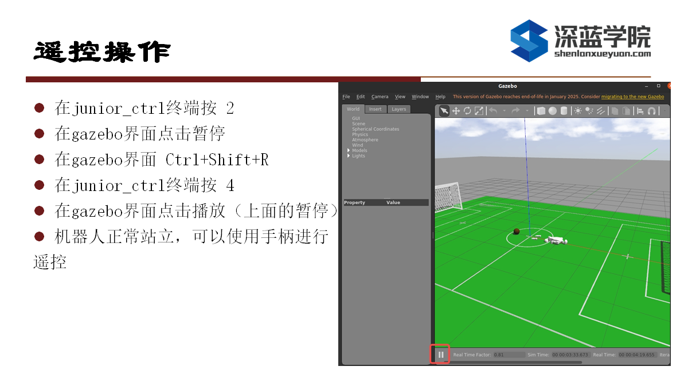

# 安装与使用指南

## 一. 环境必备

### ROS1 环境安装，版本为 Noetic

使用鱼香ROS一键安装指令:
wget <http://fishros.com/install> -O fishros && . fishros

安装完毕后重启系统。

### Gazebo 环境安装, 版本为 Gazebo Classic

参照以下安装流程：

#### 1. 更新系统

sudo apt update && sudo apt upgrade -y

#### 2. 安装依赖库

sudo apt install -y \
    cmake \
    curl \
    git \
    libfreeimage-dev \
    libprotoc-dev \
    protobuf-compiler \
    libignition-math6-dev \
    libsqlite3-dev \
    libtinyxml2-dev \
    libgflags-dev \
    libavformat-dev \
    libavcodec-dev

#### 3. 添加 Gazebo 官方软件源

sudo apt install -y wget
wget <https://packages.osrfoundation.org/gazebo.gpg> -O /usr/share/keyrings/pkgs-osrf-archive-keyring.gpg
echo "deb [arch=$(dpkg --print-architecture) signed-by=/usr/share/keyrings/pkgs-osrf-archive-keyring.gpg] http://packages.osrfoundation.org/gazebo/ubuntu-stable $(lsb_release -cs) main" | sudo tee /etc/apt/sources.list.d/gazebo-stable.list > /dev/null

#### 4. 安装 Gazebo

sudo apt update
sudo apt install -y gazebo11 libgazebo11-dev

#### 5. 配置环境变量

echo "source /usr/share/gazebo/setup.sh" >> ~/.bashrc
source ~/.bashrc

#### 6. 验证安装

gazebo worlds/empty.world

安装完毕后重启系统。

### Eigen3.4 安装，版本为3.4

官方地址：<https://eigen.tuxfamily.org/>
下载Eligen3.4库代码并解压到当前目录。

```bash
tar -xzf eigen-3.4.0.tar.gz
cd eigen-3.4.0
```bash
编译并安装。
```bash
mkdir build
cd build
cmake ..
sudo make install
```

### RealSense SDK 安装

```bash
sudo apt-get install ros-$ROS_DISTRO-realsense2-camera
```

### 安装遥控器ros驱动：ros-noetic-joy

```bash
sudo apt-get install ros-$ROS_DISTRO-joy
```

### Ignition-math 安装

```bash
sudo apt install libignition-math4-dev
```

## 二. 编译流程

```bash
cd ~/robocup_g1/
catkin_make
```

## 三. 启动流程

```bash
# 1 启动仿真环境
source devel/setup.bash
roslaunch unitree_guide gazebo.launch

# 2 启动控制器
source devel/setup.bash
./devel/lib/unitree_guide/junior_ctrl 

# 3 在junior_ctrl按2
# 4 在gazebo界面点击暂停
# 5 在gazebo界面点击:ctrl+shift+r
# 6 在junior_ctrl按4
# 7 在gazebo界面点击暂停
```



## 四. 模式切换

在 `junior_ctrl` 主界面输入 `2`，控制机器人从 **State_Passive** 切换到 **fixed stand**。回到 Gazebo 主界面，按下暂停键，然后在主菜单中选择 **Edit/Reset Model Poses** 以重置机器人的位姿。在 `junior_ctrl` 主界面输入 `4`，控制机器人从 **fixed stand** 切换到 **LOCOMOTION**。回到 Gazebo 主界面，点击播放键，重启应用。

## 五. xbox360遥控控制G1行走

1、导航指示灯指向1亮
2、左手摇杆控制前后、左右移动
3、右侧摇杆控制左转和右转

## 六. 运行建图

一、说明：

环境要求：ubuntu20.04 ros1 noetic
如果是canda环境请先退出！！conda deactivate或暂时在.bashhrc里注释掉conda的自启动。

1、编译：

 Compile and install the Livox-SDK2:

```shell
cd catkin_ws/Livox-SDK/
mkdir build
cd build
cmake .. && make -j
sudo make install
cd catkin_ws/
source /opt/ros/noetic/setup.bash
catkin_make
```

```shell
2、运行建图（先启动gazebo仿真，并让机器人进入到locomotion）
建图：

运行算法：

source devel/setup.bash
roslaunch unitree_guide room.launch
roslaunch fast_lio mapping_mid360.launch
```

```shell
3、运行定位：（键盘控制漫游建完图，然后才能进行定位）
定位：
运行算法：

source devel/setup.bash

roslaunch mid360_locate localization.launch
```

二、作业要求：
1、在新增的仿真环境中进行建图，行走距离30-300m的范围
2、在新建地图中执行定位程序，通过rviz给初始化位姿，完成初始化和漫游定位
